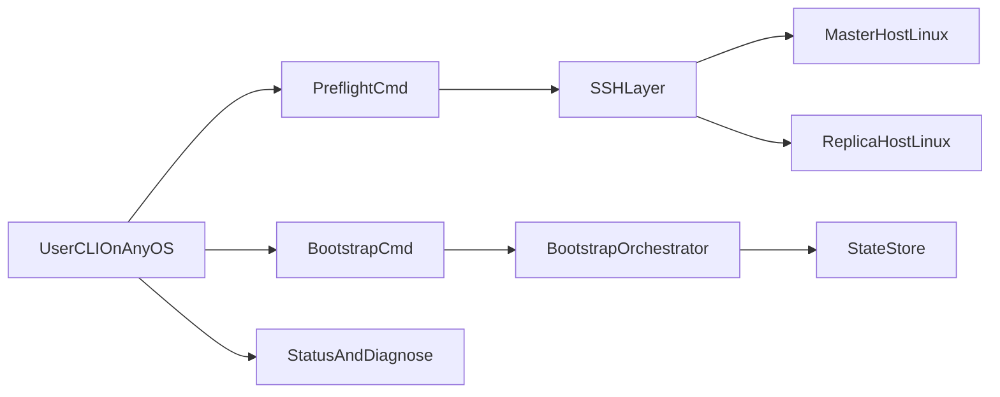

# 架构设计

## 1. 目标

构建一个跨端 CLI（Linux/Windows/macOS 控制端）来远程编排 Linux 主从机器，实现 MySQL 主从“零登录”配置体验。

## 2. 模块划分

- `cmd/replpilot`：程序入口
- `internal/command`：命令行参数与用户交互
- `internal/orchestrator`：步骤编排与状态推进（待实现）
- `internal/ssh`：远程执行封装（待实现）
- `internal/mysql`：SQL 操作封装（待实现）
- `internal/state`：checkpoint 与回滚状态（待实现）
- `internal/audit`：操作审计日志（待实现）

## 3. 核心流程

## 4. 设计原则

- 小步迭代：先打通命令流程，再补齐编排与容错。
- 可回滚：每个关键步骤写入 checkpoint。
- 可观测：统一输出任务 ID、阶段状态、错误建议。
